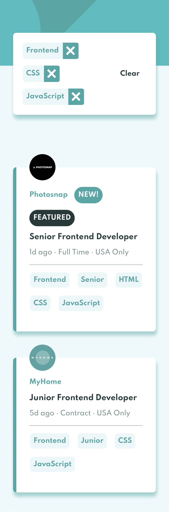

# Frontend Mentor - Job listings with filtering

## Overview

### The challenge

The challenge is to build out this job listing page and get it looking as close to the design as possible.

Your users should be able to:

- View the optimal layout for the site depending on their device's screen size
- See hover states for all interactive elements on the page
- Filter job listings based on the categories

### Filtering

The data will be pulled from a [data.json](./src/data/data.json) file and dynamically added.

To add a filter, the user needs to click on the tablets on the right-side of the listing on desktop or the bottom on mobile. For each filter added, only listings containing all selected filters will be returned.

### Screenshots

#### Desktop

#### Mobile

### Links

- [Solution URL](https://github.com/nogyuuu/static-job-listings)
- [Live site](https://static-job-listings-nogyuuu.netlify.app/)

### Built with

- React
- CSS
- Mobile-first workflow
